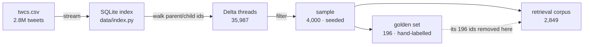
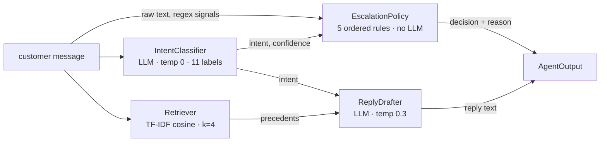
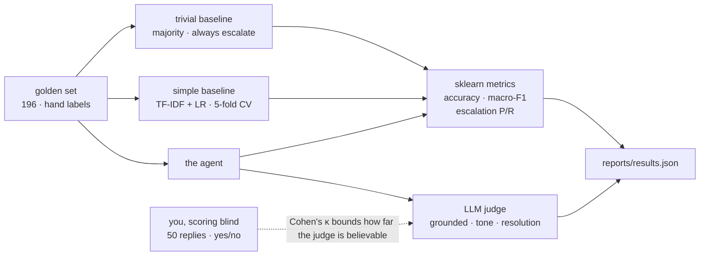

# Architecture

Three separable systems sharing one config file: an **offline data pipeline** that turns
2.8M raw tweets into a small committed corpus, a **runtime agent** that handles one
customer message, and an **evaluation harness** that scores the agent against two
baselines and a hand-labelled ground truth. They are separate because they fail
separately, and because a grader must be able to run the third without ever touching the
first.

## 1. Offline pipeline

The dotted edge is the one that matters. If the golden threads stayed in the retrieval
corpus, the drafter would retrieve the exact conversation it is being graded on and copy
Delta's real reply — a near-perfect score measuring nothing.

**Why SQLite rather than pandas.** The dataset is a forest, not a list: each row points at
its parent through `in_response_to_tweet_id` and at its children through a
comma-separated `response_tweet_id`, so rebuilding a conversation needs random access by
tweet id. Holding the frame plus an index comfortably exceeds a laptop's memory, and
every experiment would pay a ~60s reload. One streaming pass into SQLite makes every
later step cheap and interruptible.

**What counts as a thread.** The *first* inbound tweet is the message the agent must
handle, and the brand's first substantive reply is the reference. Later customer turns
are responses to Delta's reply, so scoring them would leak the answer into the input.

## 2. Runtime agent

Classification and retrieval are independent — retrieval never sees the predicted intent
— so a misclassification degrades the draft's framing without destroying its grounding.
Every intermediate output is kept, so a bad reply can be attributed to the stage that
caused it rather than to "the agent".

**Why the escalation policy contains no LLM.** Escalation is a business decision a support
lead must be able to read, argue with and change. A rule that fires on a named signal can
be audited; a model's opinion cannot. The LLM contributes signals (intent, confidence),
the rules decide, and every decision carries the rule that produced it. The rules are
ordered by severity — legal/safety language, then a customer who appears stranded, then
anything needing private account data, then intents rarely resolvable in public, then low
classifier confidence. Ties escalate: a wrongly auto-handled stranded customer costs far
more than a needlessly escalated easy one.

**Why TF-IDF and not embeddings.** Sentence embeddings match paraphrases better and would
pull ~2GB of PyTorch into a setup the grader must finish in 15 minutes. TF-IDF is
deterministic, needs no quota, and its weakness — matching words rather than meaning — is
a measurable failure mode rather than a hidden one.

## 3. Evaluation harness

The two baselines answer different questions. The **trivial** one measures how much of any
headline accuracy is just class imbalance. The **simple** one asks whether the LLM earns
its latency and quota at all — if the agent beats it by two points, that is a finding to
report plainly.

With only 196 labels there is no room for a held-out split *and* a meaningful test set, so
the simple baseline is scored by 5-fold cross-validation while the agent and trivial
baseline see no labels at all. That asymmetry slightly favours the baseline, and is stated
rather than quietly enjoyed.

## 4. The LLM wrapper

Every model call goes through one class (`llm.py`):

- **Disk cache** keyed by provider, model, temperature and exact prompt — a re-run costs
  zero calls, which is what makes results reproducible under a free-tier quota.
- **Rate limiter**, because free tiers refuse rather than queue.
- **Retries** with backoff, so one transient 503 does not kill a 200-example run.
- **Provider switch** — Gemini retired the configured model mid-project and its named
  replacement allowed 20 requests per *day* against the ~570 needed. Moving to Groq was a
  one-line config change.
- **Preflight**, one uncached call before the run, so a dead model fails in two seconds
  with the provider's own message.

### The bug worth knowing about

An early classifier caught bare `Exception` and returned `{"intent": "unparseable"}`. When
the model was retired, all 196 classifications "succeeded" while every one had actually
failed — the harness would have reported a precise, confident, entirely fictional
accuracy. **In an evaluation harness, a fallback returning a plausible default does not
degrade gracefully; it manufactures data.** Now only unparseable model output counts as a
model failure and transport errors crash. See DECISIONS.md #15.

## 5. Leakage boundaries

Three places the design deliberately gives up an easy number:

- Retrieval excludes the golden ids, or the drafter retrieves the thread it is graded on.
- The simple baseline is cross-validated, or it is scored on rows it was fitted to.
- The human judge scores blind, or the agreement statistic is self-congratulation.

A fourth is imperfect and reported as such: three of the eleven intents were defined
*after* reading examples that are in the golden set, so per-class scores on those three
are optimistic.

## 6. What was deliberately not built

- **Multi-turn conversation.** Only the first customer message is handled; follow-ups are
  a different problem needing a different evaluation.
- **Fine-tuning.** 196 labels is far too few, and would consume labels worth more as a
  test set.
- **Inbox/queue integration.** The deliverable is a measured decision function, not a
  deployment.
- **Banking77.** Its labels are banking-shaped and would impose categories Delta's traffic
  does not contain.
- **Automatic sending.** Even an "auto" decision produces a draft for review.

## 7. File map

| Module | Responsibility | Calls a model? |
|---|---|---|
| `config.py` | Loads config.yaml and .env; nothing else hardcodes a path | No |
| `llm.py` | Cache, rate limit, retries, provider switch | Yes — the only place |
| `intents.py` | The 11 intents and the labelling tie-break rules | No |
| `data/index.py` | CSV → SQLite, streaming | No |
| `data/threads.py` | Rebuilds conversations from parent/child ids | No |
| `data/sample.py` | Filtering and the seeded subsample | No |
| `agent/classifier.py` | Message → intent + confidence | Yes |
| `agent/retriever.py` | Message → k historical (message, reply) pairs | No |
| `agent/drafter.py` | Precedents + intent → one tweet-length reply | Yes |
| `agent/escalation.py` | Signals → auto/escalate + the rule that fired | No |
| `agent/pipeline.py` | Wires the four stages, keeps every intermediate | — |
| `eval/baselines.py` | The trivial and simple comparators | No |
| `eval/metrics.py` | Accuracy, macro-F1, escalation P/R, Cohen's κ | No |
| `eval/judge.py` | Rubric scoring of reply quality | Yes |
